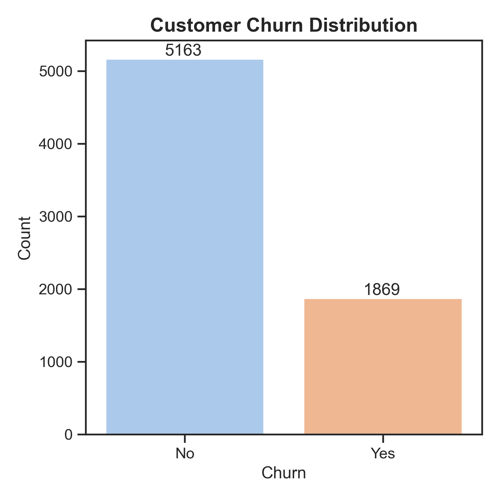
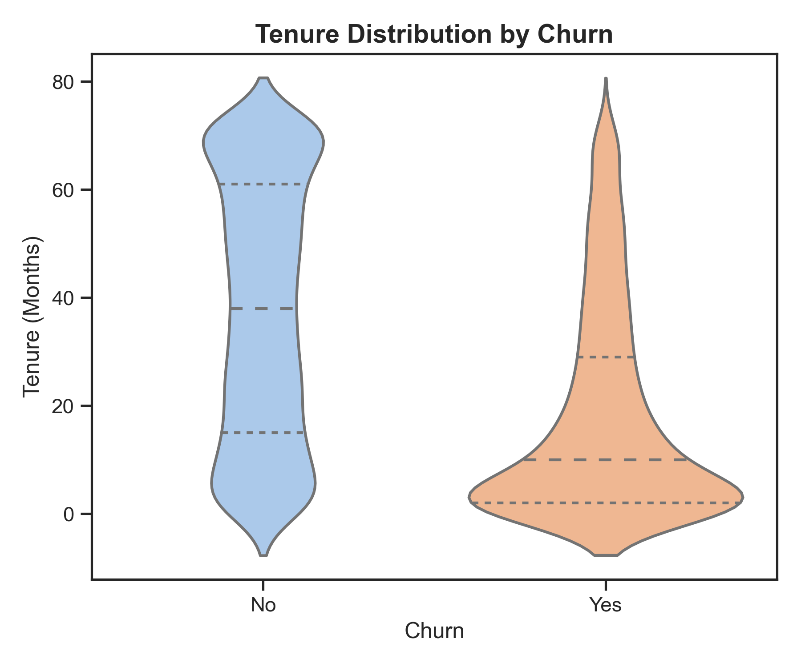
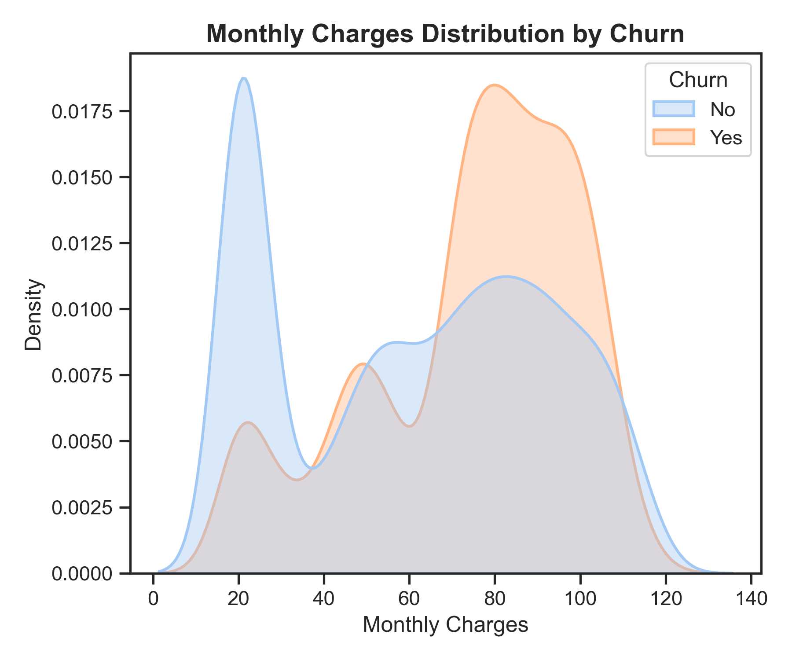
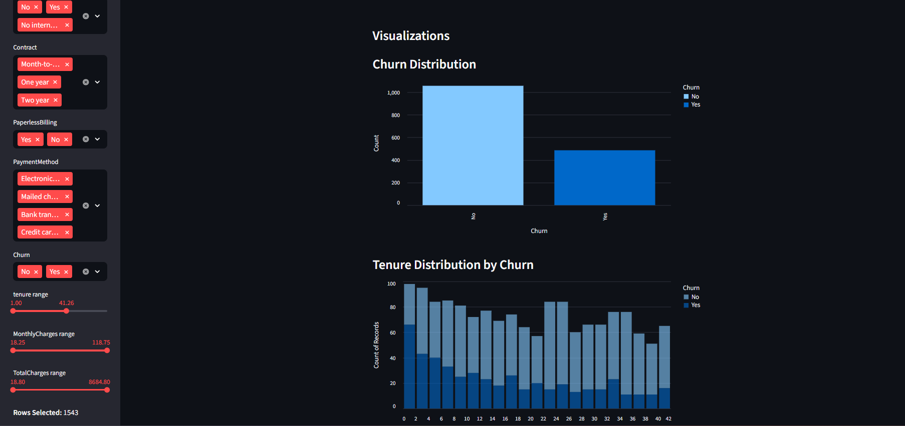
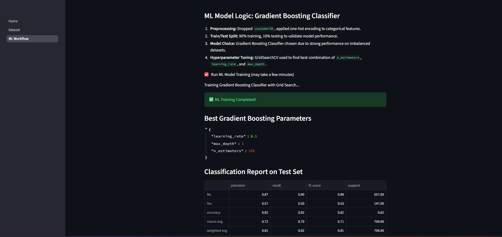
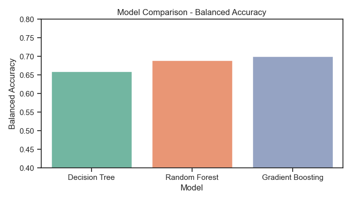
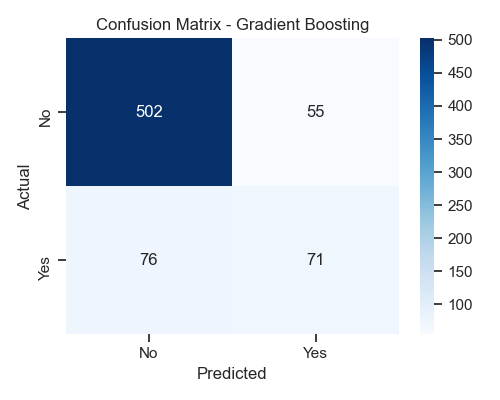

# Customer Churn Prediction Project


## Project Overview

This project focuses on predicting customer churn for a telecom company. The primary goal is to **identify customers likely to churn** and provide actionable insights to reduce churn. While the project includes a **Streamlit frontend for dataset exploration** , the **main emphasis is on the ML workflow**, feature engineering, and model performance.
[**Streamlit App**](https://csp-rak2315.streamlit.app/)

---

## Dataset  
This project uses the **Telco Customer Churn**: [Customer Churn Prediction](https://www.kaggle.com/code/bhartiprasad17/customer-churn-prediction/data)  
containing information about 7,043 customers, including:
- Customer demographics (gender, senior citizen status, partner/dependent)
- Account information (tenure, contract type, payment method)
- Service usage details (phone service, internet service, streaming, tech support)
- Target: `Churn` (Yes/No)
### Dataset Preview
| customerID | gender | SeniorCitizen | Partner | Dependents | tenure | PhoneService | MultipleLines | InternetService | OnlineSecurity | OnlineBackup | DeviceProtection | TechSupport | StreamingTV | StreamingMovies | Contract        | PaperlessBilling | PaymentMethod             | MonthlyCharges | TotalCharges | Churn |
|------------|--------|---------------|---------|------------|--------|--------------|---------------|-----------------|----------------|--------------|------------------|-------------|-------------|-----------------|----------------|-----------------|---------------------------|----------------|--------------|-------|
| 7590-VHVEG | Female | 0             | Yes     | No         | 1      | No           | No phone      | DSL             | No             | Yes          | No               | No          | No          | No              | Month-to-month | Yes             | Electronic check          | 29.85          | 29.85        | Yes   |
| 5575-GNVDE | Male   | 0             | No      | No         | 34     | Yes          | No            | DSL             | Yes            | No           | Yes              | No          | No          | No              | One year       | No              | Mailed check              | 56.95          | 1889.50      | No    |
| 3668-QPYBK | Male   | 0             | No      | No         | 2      | Yes          | No            | DSL             | Yes            | Yes          | No               | No          | No          | No              | Month-to-month | Yes             | Mailed check              | 53.85          | 108.15       | Yes   |
| 7795-CFOCW | Male   | 0             | Yes     | No         | 45     | No           | No phone      | DSL             | No             | Yes          | No               | Yes         | No          | No              | One year       | No              | Bank transfer (automatic) | 42.30          | 1840.75      | No    |
| 9237-HQITU | Female | 0             | No      | No         | 2      | Yes          | No            | Fiber optic     | No             | No           | No               | No          | No          | No              | Month-to-month | Yes             | Electronic check          | 70.70          | 151.65       | Yes   |


---

## Features Explored

- **Categorical:** gender, Partner, Dependents, InternetService, Contract, PaymentMethod, etc.
- **Numerical:** tenure, MonthlyCharges, TotalCharges
- **Target variable:** Churn (Yes/No)

---
## Exploratory Data Analysis (EDA)

The first step is understanding the dataset and identifying patterns related to churn.

### Churn Distribution
<p align="center">
  
</p>
Shows the overall churn rate and highlights class imbalance.

### Tenure vs Churn
<p align="center">
  
</p>
Indicates which tenure segments are more likely to churn.

### MonthlyCharges & Churn
<p align="center">
  
</p>
Shows the relationship between monthly charges and churn likelihood.

---

## Streamlit App

The project includes a **Streamlit web app** that provides an **interactive interface** for exploring the dataset, visualizing key patterns, and analyzing model results. It allows both technical and non-technical users to gain insights without touching the code.

### Key Features

- **Interactive Dataset Exploration**  
  Preview the dataset, filter by categorical and numerical columns, and download the filtered dataset as CSV.

- **Visualizations**  
  The app provides multiple charts to explore churn patterns and customer behavior:
  - Churn distribution
  - Tenure vs Churn
  - MonthlyCharges and TotalCharges distributions
  - Contract type & Internet service analysis
  - Correlation heatmap
  - Custom scatter plots with user-selected axes and color encoding

- **Model Results**  
  View model evaluation results including confusion matrix and training metrics.

### Screenshots

#### Dataset Explorer
<p align="center">
  
</p>

#### ML Training Results
<p align="center">
  
</p>

### Navigation

- **Entry point:** `Home.py`  
- **Additional pages:**  
  - `pages/1_Dataset.py` – Dataset exploration and visualizations  
  - `pages/2_ML Workflow.py` – Model training, evaluation, and insights

## Machine Learning Workflow

### Preprocessing

1. Drop unnecessary columns (`customerID`)
2. One-hot encoding for categorical features
3. Train-test split (90%-10%)
4. Handle class imbalance using **Balanced Accuracy** metric

### Model Selection

Tested several models:

| Model             | Best CV Balanced Accuracy | Test Set Churn Recall | Test Set Balanced Accuracy |
|------------------|-------------------------|---------------------|---------------------------|
| Decision Tree     | 0.7157                  | 0.44                | 0.66                      |
| Random Forest     | 0.7148                  | 0.46                | 0.69                      |
| Gradient Boosting | 0.7194                  | 0.50                | 0.70                      |

**Gradient Boosting Classifier (GBC)** was selected as the **best model**.

<p align="center">
  
</p>

### Hyperparameter Tuning (Grid Search)

- `learning_rate`: 0.1  
- `max_depth`: 3  
- `n_estimators`: 100  

### Model Evaluation

- **Classification Report**:

| Class | Precision | Recall | F1-score | Support |
|-------|-----------|--------|----------|---------|
| No    | 0.87      | 0.90   | 0.89     | 557     |
| Yes   | 0.57      | 0.50   | 0.53     | 147     |
| **Accuracy** | - | - | 0.82 | 704 |
| **Macro avg** | 0.72 | 0.70 | 0.71 | 704 |
| **Weighted avg** | 0.81 | 0.82 | 0.81 | 704 |

- **Confusion Matrix (Test Set)**: Highlights correct predictions of churn and non-churn customers on the **10% test split** (~704 samples).  
  <p align="center">
    
  </p>

---

## Business Implications

- **Target high-risk customers:**  
  Customers predicted as likely to churn (true positives) can be offered **personalized retention campaigns**, such as discounted plans, loyalty rewards, or proactive customer support. This helps reduce churn cost-effectively by focusing on customers who are most likely to leave.

- **Prioritize churn reduction for vulnerable segments:**  
  Analysis shows **new customers** and those with **higher monthly charges** are more likely to churn. Tailored engagement strategies, such as onboarding support for new users or flexible payment options for high-spending customers, can improve retention.

- **Monitor contract types and services:**  
  Customers on **month-to-month contracts** and with **Fiber Optic internet** tend to churn more than others. Offering incentives to switch to longer-term contracts or bundled services may reduce churn.

- **Balanced Accuracy of 0.70:**  
  Indicates the model fairly accounts for both churned and retained customers, which ensures that retention efforts are not biased toward any single group.  

- **Churn Recall of 50%:**  
  Ensures that a significant portion of churners are correctly identified for action. While not perfect, this provides a solid foundation for **preventive strategies**, especially when combined with business rules.

- **Segmented marketing and upselling opportunities:**  
  Understanding churn patterns allows marketing teams to design **targeted campaigns**, cross-sell relevant services, or adjust pricing plans for different segments to increase satisfaction and loyalty.

- **Resource allocation optimization:**  
  By predicting churn, customer support and retention teams can **allocate resources efficiently**, focusing on high-risk customers rather than using a blanket approach.

- **Continuous monitoring and feedback:**  
  Integrating this model into a business workflow enables **real-time churn monitoring**. Feedback loops can refine the model over time, capturing new patterns in customer behavior and improving retention strategies.

- **Strategic decision-making:**  
  Insights from the model can inform **pricing strategy, product bundling, and customer experience improvements**, turning churn prediction into a key driver of business growth.

---

## How to Run the Project

### Streamlit App 

```bash
# Clone repo
git clone https://github.com/RAK2315/customer-churn-predictor.git
cd customer-churn-predictor

# Create and activate virtual environment
python -m venv .venv
.venv\Scripts\activate   # Windows
# or source .venv/bin/activate   # Linux/Mac

# Install dependencies
pip install -r requirements.txt

# Run Streamlit app
streamlit run Home.py